# Alpha-101 / GTJA-191 leakage-safe research framework

This repository asks one narrow question: do price, volume, volatility, regime, Alpha-101, and
GTJA-191 features predict economically meaningful cross-sectional equity returns **out of sample and
after costs**? It prioritizes causal alignment and reproducibility over headline backtests.

> Current conclusion: **No evidence of tradable alpha.** No real point-in-time panel or frozen
> holdout is bundled. The deterministic synthetic run is a CI check, not a backtest.

## Architecture

```mermaid
flowchart LR
    A[Point-in-time panel provider] --> B[Schema and data validation]
    B --> C[Trailing features and validated factors]
    C --> D[Next-open residual/rank targets]
    D --> E[Purged walk-forward train/validation/test]
    E --> F[Fold-local preprocessing and models]
    F --> G[Regime/CUSUM/meta-label candidates]
    G --> H[Constrained portfolio]
    H --> I[Open t+1 execution and costs]
    I --> J[IC, net metrics, robustness, registry]
```



Signals are formed after close `t`, enter at open `t+1`, and exit according to the target horizon.
Forward-label intervals are purged from training; validation is separate from test; embargo is
configurable. Scalers and estimators are fit only inside the training fold.

## Repository map

- `quant_research/data`: provider interface, normalization, universe disclosure, validation.
- `quant_research/features`: trailing technical/regime features and validated factor adapters.
- `quant_research/targets`: return/residual/rank targets and triple barriers.
- `quant_research/validation`: purged expanding walk-forward splits.
- `quant_research/models`: fold-local Ridge, Random Forest, optional XGBoost/LightGBM.
- `quant_research/portfolio` and `backtest`: exposure caps, sizing, costs, metrics.
- `quant_research/experiments`: configuration runner, registry, synthetic smoke data, plots.
- `docs/research_audit.md`: issue-by-issue legacy audit.
- Legacy notebooks/scripts remain unchanged and are not imported by the trusted package.

## Factor-integration boundary

The old scripts contain deprecated APIs, provider dependencies, and mistranslated formulas. The new
API currently promotes only representative Alpha 012/101 and GTJA 002/012 implementations. This is
deliberately smaller than a nominal "292 factor" library: each additional factor must first receive a
formula test and a causality test.

## Reproduce

```bash
python -m venv .venv
.venv/bin/pip install -e '.[dev]'
.venv/bin/ruff check quant_research tests
.venv/bin/pytest
.venv/bin/python -m quant_research.experiments.runner --smoke
```

For real research, supply a `(date, symbol)` panel at the path configured in
`configs/research.yaml`. Required columns are `open`, `high`, `low`, `close`, `adjusted_close`,
`volume`, `sector`, and `market_return`. The data provider must document membership, delistings,
adjustments, timestamps, and licensing. Do not call a static current-index universe survivorship-free.

Experiment JSON and CSV records include timestamp, commit, dataset version, universe, target,
features, model, parameters, costs, validation, status, and metrics. Parquet output is also written
when `pyarrow` is installed.

## Research protocol and limitations

Run a staged rather than exhaustive matrix: target/horizon with Ridge; promoted tree models;
residualization; portfolio/costs; then regimes, CUSUM, meta-labels, and sizing. Preserve a terminal
holdout and score robustness across folds, years, sectors, regimes, cost scenarios, and parameter
neighbors. Benchmark SPY, equal weight, momentum, and mean reversion. Account for multiple testing.

See [the audit](docs/research_audit.md) and [research report](docs/final_research_report.md) for the
full evidence boundary and unresolved institutional-data, borrow, impact, capacity, and factor-validation
limitations.
